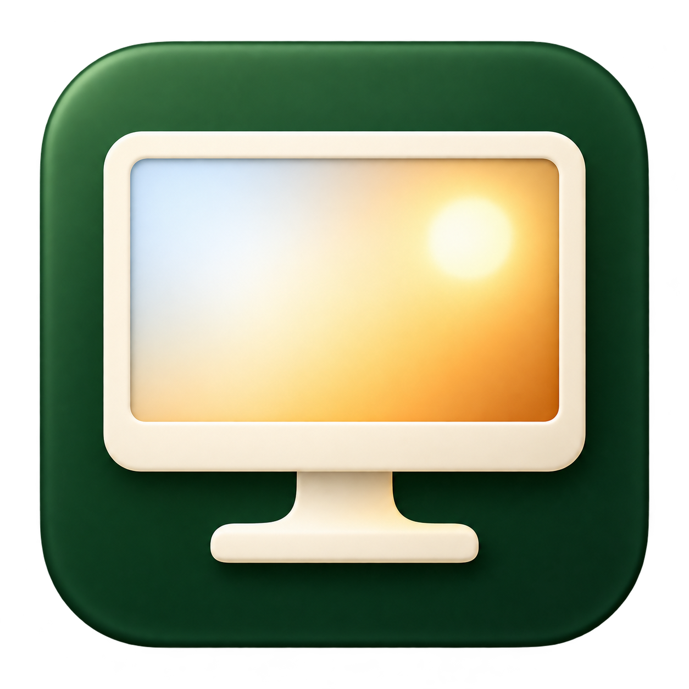

# 原彩显示



Windows 中文屏幕调色工具。支持硬件亮度、手动冷暖、北京日照自动调节、色温漂移刻度和一键恢复，调节作用于整个 SDR 桌面。

**本项目是独立软件，与 Apple 无关联。当前没有实现 Apple True Tone 的环境光测色适应，也没有验证与 iPhone 15 一致。界面中的 K 值是调节模型目标，不是屏幕实测色温。**

## 下载与运行

在仓库的 **Releases** 中下载 Windows ZIP 软件包，解压后双击 `原彩显示.exe`。运行时不需要联网或管理员权限；使用 Windows 自带的 .NET Framework。

1. 勾选右上角 **开启调节**。仅打开窗口不会默认开始调色。
2. 北京日照以北京时间 UTC+8 和北京中心点计算日出、日落；白天基础目标 5700 K，夜间 4200 K，切换持续 60 分钟。
3. **色温漂移**可在当前模式上加减 −1500～+1500 K，每格 50 K。负值更暖，正值更冷；目标限制在 3600～6500 K。例如 5700 K 加 −500 K，目标为 5200 K。
4. **适应强度**控制调节幅度。漂移与强度会自动保存。
5. **漂移归零**恢复当前模式基础目标；**恢复原始颜色**停止调节并恢复接管前颜色；**恢复颜色并退出**结束程序。
6. 关闭窗口默认留在托盘。登录启动需要自己勾选启用。

## 屏幕亮度

顶部亮度滑块直接设置屏幕硬件亮度，并读回确认；与色温开关相互独立。程序启动时读取系统当前亮度，退出时保留用户设置的亮度。点击“恢复打开时亮度”恢复本次打开程序时的数值。

参考 PowerToys PowerDisplay 的硬件控制方式，独立实现内置屏幕 WMI 和外接屏幕 DDC/CI（VCP 0x10）两种路径。按活动屏幕标识与可用接口匹配，不依据核显/独显名称决定路径：由独显驱动的内置屏幕也可能使用 WMI。外接屏幕需支持 DDC/CI；未检测到有效接口时不提供可调滑块。本机已验证 WMI 亮度从 70% 调低、读回并恢复；外接 DDC/CI 尚无硬件实测。滑块拖动合并为间隔操作，硬件查询在后台进行，不叠加软件遮罩。

## 显示与恢复

- 显卡 SDR 颜色曲线写入后进行读回核对；遇到冲突暂停。
- 正常退出时恢复颜色；独立恢复进程在异常退出时尝试还原。
- HDR / 高级颜色开启或状态无法确认时暂停调节。
- 检测到显示设备变化或休眠时恢复并停止调节。
- 另有 `恢复颜色.cmd` 恢复入口。
- 设置与恢复记录保存在当前用户的 `%LOCALAPPDATA%\AmbientTone`，不会上传。

## 能力边界

- 北京时钟无法测量房间灯光颜色。照度模式仅在有可用 Windows 光线传感器时启用，也不能测量环境光颜色。
- 没有对每块显示屏进行仪器校准，不能保证实际显示白点等于界面 K 值。
- 普通截图不能证明物理调色或跨屏对齐：本机测试中，输出曲线变化而截图像素完全相同。
- 当前为 Windows 10 上验证的 SDR 工具；其他系统、显示器和显卡仍需实际验证。
- 启动窗口按屏幕可用空间限制尺寸，适应高缩放；内容可滚动，关键恢复按钮放在固定底部。多屏不同缩放比例仍需进一步验证。
- 程序未进行代码签名。

## iPhone 15 对照

`验证/iPhone15对照页.html` 提供相同的白色、灰色和 18 个 sRGB 色块；`iPhone15实测模板.csv` 用于记录仪器测得的 x/y 色度和亮度。

参考目标为标准版 iPhone 15，原彩开启、夜览关闭，普通 SDR 内容。真实对齐需要在相同灯光下取得参考设备的实际测量，当前目标配置明确标记为未验证。

`对齐验证.exe` 可以显示固定色块和比较测量文件。打开前先恢复并退出主程序，避免同时控制颜色。缺失测量不会被判定为对齐；照片仅供辅助目视比较。

## 从源码构建

Windows 上打开 PowerShell，在项目目录执行：

```powershell
powershell -NoProfile -ExecutionPolicy Bypass -File .\build.ps1 -Test
powershell -NoProfile -ExecutionPolicy Bypass -File .\build-validation.ps1
```

使用系统 .NET Framework C# 编译器、WPF、WinRT 传感器接口，无需第三方依赖。运行 `build-icon.ps1` 可从 PNG 重新生成多尺寸 ICO。

当前验证覆盖 16 项算法和恢复数据检查、18 项界面与实际显卡输出检查，以及 5 项硬件亮度检查，包括漂移、保存、归零、范围限制和恢复。

## 图标

图标使用内置图像生成工具制作。创作提示：深绿色圆角底、象牙白屏幕轮廓、冷白到暖金色渐变、简洁且适合小尺寸、透明外边缘，无文字或 Apple 标识。PNG 和多尺寸 ICO 位于 `Assets`。

## 官方参考

- [Apple 原彩显示说明](https://support.apple.com/zh-cn/109351)
- [iPhone 15 技术规格](https://support.apple.com/zh-cn/111831)
- [Microsoft 颜色曲线接口](https://learn.microsoft.com/en-us/windows/win32/api/wingdi/nf-wingdi-setdevicegammaramp)
- [Microsoft 照度传感器接口](https://learn.microsoft.com/en-us/uwp/api/windows.devices.sensors.lightsensor)
- [PowerToys WMI 亮度源码](https://github.com/microsoft/PowerToys/blob/main/src/modules/powerdisplay/PowerDisplay.Lib/Drivers/WMI/WmiController.cs)
- [PowerToys DDC/CI 亮度源码](https://github.com/microsoft/PowerToys/blob/main/src/modules/powerdisplay/PowerDisplay.Lib/Drivers/DDC/DdcCiController.cs)